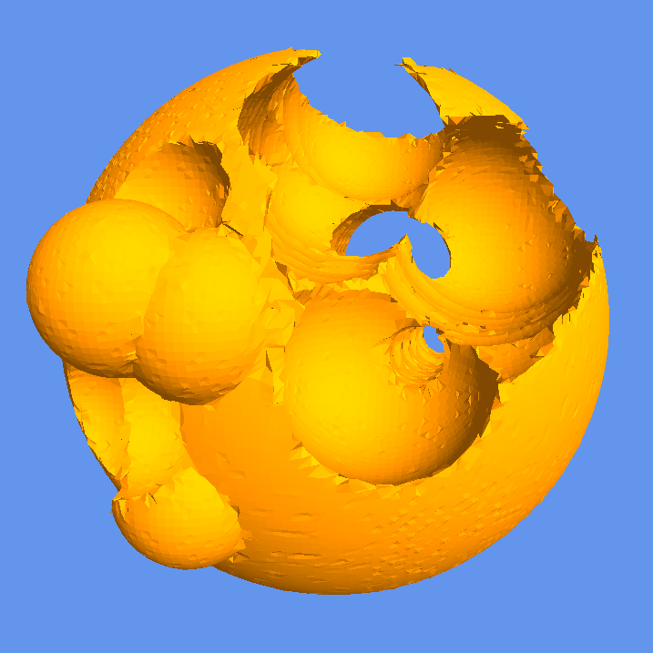

# Dual Contouring Terrain Editor

    
    

This is an interactive terrain editor that renders SDF-s using Dual Contouring, and allows the resulting mesh to be edited with a spherical brush.

This is a legacy codebase, an old project of mine that will not be maintained.

## Installation

### Direct Method

1. Ensure you have JDK 17 and Maven installed.
2. Run `mvn clean install` to build the project.
3. Run `mvn exec:java` to run the terrain editor.

### Using Nix Flakes

1. Run `nix build` to build the project.
2. Run `./result/bin/legacy-dual-contouring` to run the terrain editor.